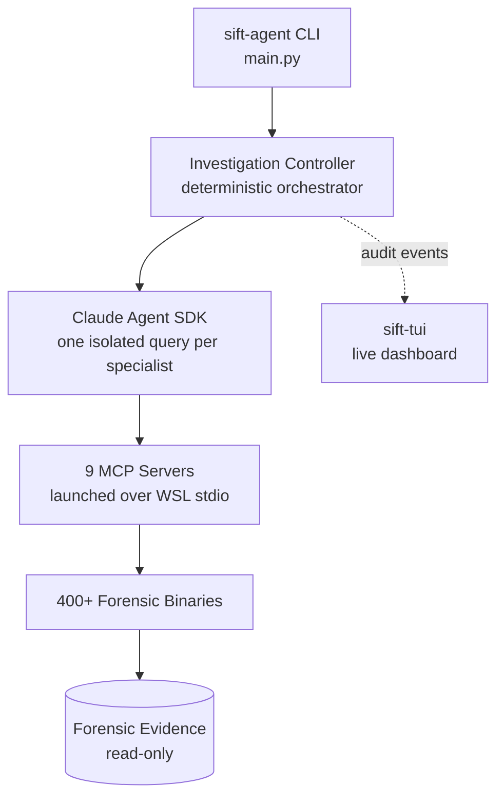
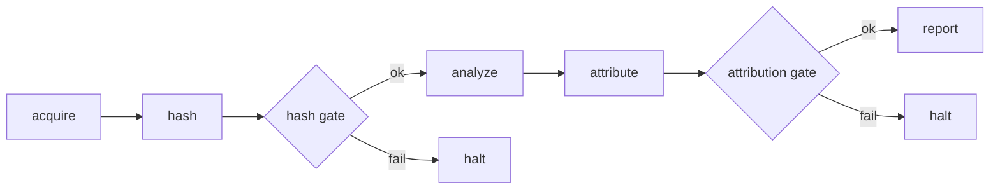
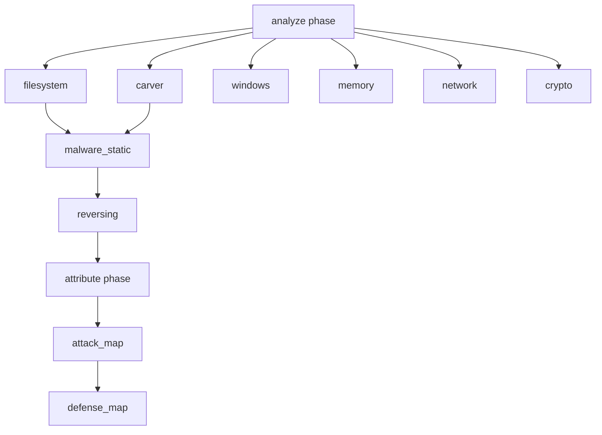

```
   ███████╗██╗███████╗████████╗
   ██╔════╝██║██╔════╝╚══██╔══╝     S E N T I N E L
   ███████╗██║█████╗     ██║        Sentinel Intelligence Forensic Tools
   ╚════██║██║██╔══╝     ██║        Claude Agent SDK · Model Context Protocol
   ███████║██║██║        ██║
   ╚══════╝╚═╝╚═╝        ╚═╝
```

**Powered by the Claude Agent SDK · Model Context Protocol · 400+ Forensic Tools**

---

## Status & Badges


---

## Overview

SIFT is a digital forensics and incident response platform that pairs Claude with 400+ forensic analysis tools. A deterministic Python controller orchestrates a chain of specialist agents, each built on the Claude Agent SDK, that drive the Model Context Protocol servers wrapping industry-standard DFIR binaries. The platform covers disk forensics, memory analysis, network investigation, Windows artifacts, static malware analysis, reverse engineering, and cryptographic assessment, and maps every finding to MITRE ATT&CK and D3FEND.

Evidence is handled read-only. Every tool invocation is hashed into a chain of custody, and two safety gates block the investigation from proceeding on unverified evidence or unattributed findings.

---

## Architecture

SIFT is composed of four components. The agent controller drives the MCP servers, which expose the forensic toolchain over the evidence; the TUI observes the controller's audit stream.



### Investigation pipeline

The controller runs a fixed, auditable sequence. Two gates guard the transitions: the hash gate requires every evidence item to be hashed before any analysis tool runs, and the attribution gate requires every finding to carry an ATT&CK technique before a report is written.



### Specialist routing

The analyze phase selects specialists from the evidence profile and re-evaluates after each pass, so candidate files surfaced by the filesystem and carver agents pull in the static malware and reversing agents. The attribute phase always runs the two mapping agents.



### Safety model

| Control | Mechanism |
|---------|-----------|
| Evidence integrity | Hash gate predicate in the controller plus a PreToolUse hook that denies every analysis tool until evidence is hashed |
| Tool scope | Each specialist runs in `dontAsk` permission mode with a namespaced `allowed_tools` list, so only its own forensic tools are callable |
| Chain of custody | Every tool result is hashed into a per-evidence custody log |
| Attribution | Attribution gate predicate blocks the report until findings carry ATT&CK techniques |
| Budget | Per-specialist turn and spend ceilings |

---

## Components

### 1. sift-agent

The investigation engine. The `agent_sdk` package implements a deterministic controller that runs each specialist as an isolated Claude Agent SDK `query()`, keeping the pipeline order provable for chain of custody.

**Key modules (`sift-agent/agent_sdk/`):**
- `main.py` — CLI entry point
- `investigation_controller.py` — phase orchestration
- `specialists.py` — specialist definitions and prompts
- `specialist_runner.py` — SDK options, hooks, and the query loop
- `mcp_servers.py` — MCP server launch configuration and tool namespacing
- `gates.py` / `hooks.py` — safety gates and the PreToolUse deny hook
- `case_state.py` — investigation state and chain of custody
- `routing.py` — specialist selection
- `report_synthesizer.py` — finding validation and report generation
- `audit_logger.py` — JSONL audit trail and cost accounting

The earlier LangGraph implementation has been removed; the Agent SDK package is the sole engine.

### 2. sift-mcp-servers

Nine independent MCP servers exposing 400+ forensic tools:

| Server | Tool Count | Focus Area |
|--------|-----------|-----------|
| sift-attack | 8 | ATT&CK threat intelligence mapping |
| sift-defend | 5 | D3FEND defensive mappings |
| sift-disk | 180 | Disk forensics and file analysis |
| sift-windows | 27 | Windows-specific forensic tools |
| sift-network | 96 | Network analysis and traffic inspection |
| sift-memory | 5 | Memory forensics tools |
| sift-hashing | 7 | Cryptographic hashing utilities |
| sift-malware | 44 | Static malware analysis tools |
| sift-crypto | 28 | Cryptographic assessment tools |

Each server wraps industry-standard forensic binaries with a standardized JSON response envelope.

### 3. sift-tui

A live investigation dashboard built with Textual. Its mock mode replays a demo session with no dependencies. Its live mode is currently wired to the removed LangGraph engine and is being reconnected to the `agent_sdk` controller; use mock mode until that lands.

### 4. sift-documents

Architecture notes, execution flows, logging design, and tool reference guides.

---

## Installation

### Prerequisites
- Python 3.11+
- WSL with Ubuntu 22.04 (hosts the SIFT forensic binaries and MCP servers)
- The Claude Code CLI, logged in, for keyless subscription auth (or an Anthropic API key)

### System Requirements

| Resource | Recommendation |
|----------|----------------|
| Python | 3.11+ |
| Environment | WSL / Ubuntu 22.04 |
| Disk space | 100 GB+ for large forensic images |
| RAM | 8 GB minimum, 16 GB recommended |
| CPU cores | 4+ for parallel tool execution |

### Setup

1. **Install the agent (Windows host Python)**
```bash
cd sift-agent
pip install -r requirements.txt
```

2. **Install the MCP server dependencies (inside WSL)**
```bash
wsl -d Ubuntu-22.04
cd "/mnt/c/Users/<you>/Downloads/SIFT - Sentinel/sift-mcp-servers/servers"
pip install -e .
```

3. **Authenticate**
   - Keyless: log in once with the Claude Code CLI and leave `ANTHROPIC_API_KEY` unset.
   - API key: set `ANTHROPIC_API_KEY`.

4. **Configure paths**
```bash
cp sift-agent/.env.example sift-agent/.env
# edit SIFT_MCP_SERVERS_DIRECTORY and SIFT_WSL_DISTRIBUTION for your setup
```

---

## Usage

### Run an investigation

Run the controller from the `agent_sdk` directory. Evidence paths must be reachable from inside the WSL distribution.

```bash
cd sift-agent/agent_sdk
python main.py --case-id incident-001 --evidence /home/you/evidence.dd
```

**Options:**
- `--case-id` — unique investigation identifier
- `--evidence` — one or more evidence file paths (WSL-accessible)

Reports are written to `SIFT_REPORTS_DIRECTORY` and the audit trail to `SIFT_AUDIT_LOG_DIRECTORY`.

### Quick smoke test

`build_test_image.sh` creates a small ext2 image with seeded forensic artifacts so you can exercise the full pipeline without a multi-gigabyte capture.

```bash
wsl -d Ubuntu-22.04 -- bash "/mnt/c/.../sift-agent/agent_sdk/build_test_image.sh"
cd sift-agent/agent_sdk
python main.py --case-id smoke --evidence /home/you/small_case.dd
```

### Configuration

| Variable | Default | Purpose |
|----------|---------|---------|
| `SIFT_WSL_DISTRIBUTION` | `Ubuntu-22.04` | WSL distribution hosting the servers |
| `SIFT_MCP_SERVERS_DIRECTORY` | repo path | MCP server scripts as seen inside WSL |
| `SIFT_WORKER_MODEL` | `haiku` | Model for analysis specialists |
| `SIFT_SUPERVISOR_MODEL` | `opus` | Model for the report narrative |
| `SIFT_MAXIMUM_TURNS_PER_SPECIALIST` | `25` | Per-specialist turn ceiling |
| `SIFT_MAXIMUM_BUDGET_USD` | `5.0` | Per-specialist spend ceiling |

### Tests

```bash
cd sift-agent/agent_sdk
python test_pure_logic.py
```

---

## Project Structure

```
SIFT - Sentinel/
├── sift-agent/
│   ├── agent_sdk/           Claude Agent SDK investigation engine
│   ├── requirements.txt
│   └── pyproject.toml
│
├── sift-mcp-servers/
│   └── servers/             9 MCP server implementations (400+ tools)
│
├── sift-tui/                Terminal UI dashboard
├── sift-documents/          Architecture and tool documentation
└── sift-datasets/           Sample forensic evidence (not tracked)
```

---

## Key Features

- **Comprehensive tooling** — 400+ forensic tools across 9 specialized MCP servers
- **Agentic orchestration** — a deterministic controller drives isolated Claude Agent SDK specialists
- **Evidence integrity** — hash verification and chain-of-custody tracking enforced by gates and hooks
- **Threat attribution** — integrated MITRE ATT&CK and D3FEND mappings
- **Auditability** — every phase, tool call, gate decision, and cost recorded to a JSONL trail
- **Keyless operation** — runs on a Claude subscription login or an API key

---

## Documentation

- [MCP Architecture & Agent Flow](./sift-documents/MCP-AGENT-FLOW-COMPLETE.md)
- [Logging & Instrumentation](./sift-documents/MCP-AGENT-LOGGING-EXPLAINED.md)
- [Tool Reference](./sift-mcp-servers/Sift-MCP-Tools.md)
- [TUI Design Guide](./sift-documents/SIFT-MCP-TUI-DESIGN-GUIDE.md)

---

## Contributing

Contributions are welcome. Please ensure new tools are wrapped through the appropriate MCP server with a standardized response envelope, and that verification tests pass.

---

## License

See individual component directories for licensing information.
